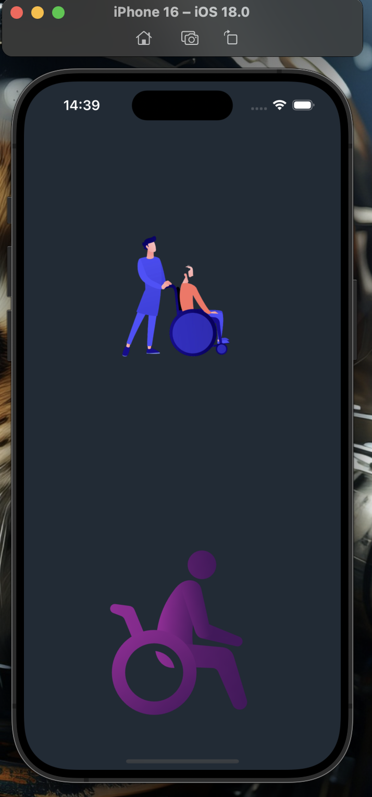

# obstatil_app


# Flutter Projesi

  


  

## Proje Hakkında

[Bu mobil uygulama, engelli bireylerin yaşam alanlarına duyarlılık yaratmayı hedeflemektedir. Uygulama, engellilerin yollarına veya kaldırımlarına park eden araçların fotoğrafını çekerek, ilgili bölgenin emniyet birimine e-posta yoluyla otomatik olarak şikayet bildirimi göndermektedir.]


## Proje Yapısı

```

lib/

├── modeller/ # Veri modelleri

├── ekranlar/ # Uygulama ekranları

├── widgets/ # Tekrar kullanılabilir arayüz öğeleri

```

  

## Ekibimiz

-  **Danışman:**  
[https://github.com/keyvanarasteh](Keyvan Arasteh)


-  **Takım Üyeleri:**

- Eren Tan [MrTann](https://github.com/MrTann)
- Mahmut Serin [mrserin20] (https://github.com/mrserin20)
- Muhammed Emin Kıroğlu [eminkiroglu] (https://github.com/eminkiroglu)

  
  

## Kullanılan Teknolojiler

- Flutter

- Dart

- Mail

-OpenAI

  
### Gereksinimler

- Flutter SDK (sürüm 3.27.2)

- Dart SDK (sürüm 3.6.1)

- [Simulator]

  
## Ekran Görüntüleri


### Yükleme ekranı


### Ana Ekran
  

### Widget Ekranı


### Ayarlar Ekranı


### Arama Ekranı


### Akıllı Asistan Ekranı


### Geçmiş Şikayetlerim Ekranı


### Demo videosu

  

## Lisans

[Lisans türü] kapsamında lisanslanmıştır. Daha fazla bilgi için `LICENSE` dosyasını inceleyebilirsiniz.

  

## İletişim

- Mail : [obstatil@gmail.com]

- Proje Bağlantısı: [https://github.com/MrTann/Obstatil]

- İstinye Üniversitesi: [https://www.istinye.edu.tr/](https://www.istinye.edu.tr/)

  

## Teşekkürler

- İstinye Üniversitesi'ne destekleri için teşekkür ederiz

- [Diğer teşekkürler]

  